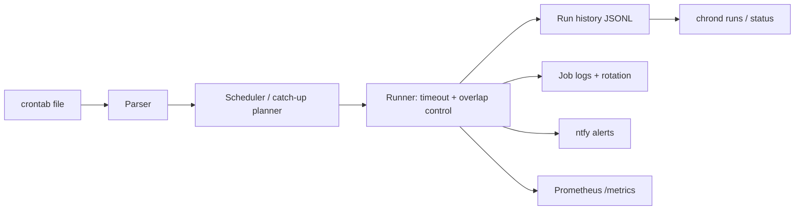

# chrond

[English](README.md) | [中文](README.zh.md) | [日本語](README.ja.md)

[](LICENSE) [](Cargo.toml) [](https://github.com/JaydenCJ/chrond/discussions)

**Rust で書き直したオープンソースの cron。取り逃した job の補完実行、照会できる実行履歴、ログローテーション、失敗アラートを備えています。**


```bash
git clone https://github.com/JaydenCJ/chrond.git && cargo install --path chrond
```

## なぜ chrond なのか

vixie-cron は静かに失敗します。02:15 にマシンが落ちていれば、02:15 のバックアップは実行されず、何の通知もありません。実行履歴もリトライもアラートもなく、「昨夜のバックアップは動いたか」を知るには syslog を grep して祈るしかありません。一方で sudo・ntp・coreutils は memory-safe な Rust で書き直され、ディストリビューションに採用済みです。cron と logrotate は残された空白でした。chrond は定時 job のこの 2 つの領域をまとめて引き受けます。crontab 構文に drop-in 互換のスケジューラに、実行 1 回ごとの構造化レコード、取り逃した job の補完実行、job ごとの出力ログとローテーション、そして Prometheus/ntfy によるアラートが付きます。

|  | chrond | supercronic | cronie (vixie) |
|---|---|---|---|
| 実装言語 | Rust | Go | C |
| 取り逃しの補完実行 | yes（job ごとの `catchup=on`） | no | no（別途 anacron） |
| 実行 1 回ごとの履歴 | yes（JSONL + `chrond runs`） | ログのみ | no |
| 多重実行の制御 | job ごと（`allow`/`skip`） | グローバル設定のみ | no |
| job ごとの timeout | yes（`timeout=30m`） | no | no |
| ログローテーション内蔵 | yes（サイズ基準・job ごと） | no | no（外部 logrotate） |
| プッシュ通知 | ntfy 内蔵 | no | MAILTO メールのみ |
| Prometheus メトリクス | yes（`/metrics` + `/health`） | yes | no |

## 特徴

- **「昨夜のバックアップは動いたか」がコマンド 1 つで分かります** — スケジュールの各時刻が構造化 JSONL レコード（`ok`、`failed`、`timeout`、`missed`、`skipped_overlap`、`spawn_error`）として残り、`chrond runs --job backup --since 24h --failed` で照会できます。
- **静かな取り逃しをなくします** — デーモン停止中に過ぎた時刻は再起動後に補完実行されます（job ごとの `catchup=on`、上限は `max_catchup`）。上限を超えた分は消えるのではなく `missed` として記録されます。
- **crontab 構文に drop-in 互換** — 標準の 5 フィールド、`@hourly`/`@reboot` エイリアス、`KEY=value` の環境行、`/etc/crontab` のユーザー列の解析に対応しています。chrond の拡張は `#[chrond]` コメントアノテーションに置くため、ファイルは従来の cron でもそのまま有効です。
- **暴走 job を制御下に** — `overlap=skip` で多重起動を防ぎ、`timeout=30m` でプロセスグループごと停止します。どちらの結果も記録され、アラート対象にできます。
- **グルースクリプトなしのアラート** — 失敗時の ntfy プッシュ通知が追加設定なしでそのまま使えます（セルフホスト可）。スクレイプ用の Prometheus テキストエンドポイントも備えています。
- **ログローテーション内蔵** — job ごとの出力を専用ログに追記し、サイズ基準でローテーションします（`log_max`、`log_keep`）。logrotate の設定は不要です。

## クイックスタート

インストール（Rust 1.75+ が必要です）:

```bash
git clone https://github.com/JaydenCJ/chrond.git && cargo install --path chrond
```

crontab を書いて検証します:

```bash
cat > mycrontab <<'EOF'
#[chrond] name=nightly-backup catchup=on timeout=30m overlap=skip notify=on_failure
15 2 * * * /usr/local/bin/backup.sh
EOF
chrond check mycrontab
```

出力:

```text
mycrontab: OK (1 job(s), 0 environment assignment(s))

  job: nightly-backup
    schedule: 15 2 * * *
    command:  /usr/local/bin/backup.sh
    catch-up: on (max 1)
    timeout:  1800s
    next[1]:  2026-07-09T02:15:00
    next[2]:  2026-07-10T02:15:00
    next[3]:  2026-07-11T02:15:00
```

デーモンをフォアグラウンドで起動し（systemd/コンテナ向き）、履歴を照会します:

```bash
chrond run --file mycrontab --metrics 127.0.0.1:9090 --ntfy https://ntfy.sh/my-alerts
chrond runs --job nightly-backup --since 24h
chrond status --file mycrontab
```

メトリクスエンドポイントは指定したアドレスにのみバインドされます。特別な理由がなければ `127.0.0.1` のままにしてください。状態データ（履歴・job 状態・ログ）はデフォルトで `~/.local/state/chrond` に保存されます（`--state` で変更可能）。

## Job アノテーション

デフォルトの挙動は vixie-cron と同じです。各 job は直前の行の `#[chrond]` コメントで拡張を有効にします。

| キー | デフォルト | 効果 |
|---|---|---|
| `name` | コマンドから導出 | 履歴・ログ・メトリクス・アラートで使う安定した job 名 |
| `catchup` | `off` | デーモン停止中に過ぎた時刻を補完実行します |
| `max_catchup` | `1` | 補完実行する最新 N 件。それより古い分は `missed` として記録されます |
| `overlap` | `allow` | `skip` は 2 つ目のインスタンスを起動せず `skipped_overlap` を記録します |
| `timeout` | なし | 超過時に job のプロセスグループごと停止します（`30s`、`5m`、`2h`、`1d`） |
| `notify` | `on_failure` | ntfy ポリシー: `never`、`on_failure`、`always` |
| `log_max` | `1M` | job の出力ログがこのサイズを超えるとローテーションします（`512K`、`1M`、`2G`） |
| `log_keep` | `4` | 保持するローテーション世代数 |

## アーキテクチャ



## ロードマップ

- [x] コアデーモン: crontab 解析、補完実行プランナー、多重実行/timeout 制御、JSONL 実行履歴、ログローテーション内蔵、Prometheus メトリクス、ntfy アラート
- [ ] systemd unit とパッケージング（drop-in なシステムサービス導入向け）
- [ ] crontab ファイル変更のホットリロード
- [ ] システム crontab のユーザー列で宣言されたユーザーとしての実行（現状は解析と警告のみで、デーモンのユーザーで実行されます）
- [ ] バックオフ付きリトライポリシーと MAILTO メール互換

全体は [open issues](https://github.com/JaydenCJ/chrond/issues) を参照してください。

## コントリビューション

コントリビューションを歓迎します。[CONTRIBUTING.md](CONTRIBUTING.md) を参照のうえ、まずは [good first issue](https://github.com/JaydenCJ/chrond/issues?q=is%3Aissue+is%3Aopen+label%3A%22good+first+issue%22) から、または [Discussions](https://github.com/JaydenCJ/chrond/discussions) でお気軽にどうぞ。

## ライセンス

[MIT](LICENSE)
