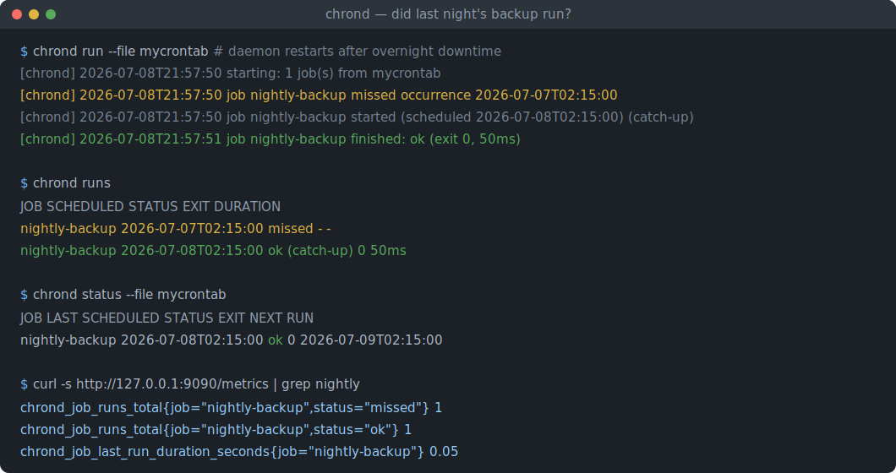
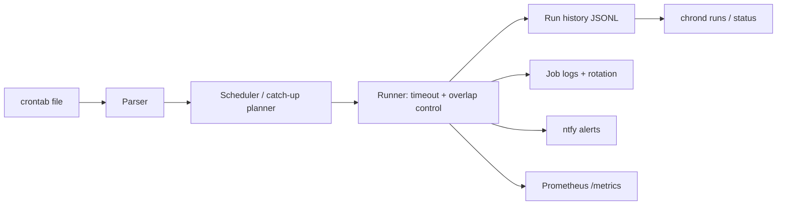

# chrond

[English](README.md) | [中文](README.zh.md) | [日本語](README.ja.md)

[](LICENSE) [](Cargo.toml) [](https://github.com/JaydenCJ/chrond/discussions)

**Open-source cron rewritten in Rust — catches up missed jobs, keeps a queryable run history, rotates logs, alerts you.**



```bash
git clone https://github.com/JaydenCJ/chrond.git && cargo install --path chrond
```

## Why chrond?

vixie-cron fails silently: if the machine is down at 02:15, the 02:15 backup simply never happens and nothing tells you. There is no run history, no retry, no alerting — answering "did last night's backup run?" means grepping syslog and hoping. Meanwhile sudo, ntp and coreutils have all been rewritten in memory-safe Rust and adopted by distributions; cron and logrotate are still the unclaimed pair. chrond replaces both concerns for scheduled jobs: a drop-in crontab-compatible scheduler with per-occurrence structured records, missed-job catch-up, per-job output logs with built-in rotation, and native Prometheus/ntfy alerting.

|  | chrond | supercronic | cronie (vixie) |
|---|---|---|---|
| Language | Rust | Go | C |
| Missed-run catch-up | yes (per-job `catchup=on`) | no | no (separate anacron) |
| Per-occurrence run history | yes (JSONL + `chrond runs`) | logs only | no |
| Overlap control | per job (`allow`/`skip`) | global default only | no |
| Per-job timeout | yes (`timeout=30m`) | no | no |
| Built-in log rotation | yes (size-based, per job) | no | no (external logrotate) |
| Push alerts | ntfy built-in | no | MAILTO email only |
| Prometheus metrics | yes (`/metrics` + `/health`) | yes | no |

## Features

- **"Did last night's backup run?" is one command** — every schedule occurrence is recorded as a structured JSONL record (`ok`, `failed`, `timeout`, `missed`, `skipped_overlap`, `spawn_error`); query it with `chrond runs --job backup --since 24h --failed`.
- **No more silent gaps** — occurrences missed while the daemon was down are replayed on restart (per-job `catchup=on`, capped by `max_catchup`); anything beyond the cap is recorded as `missed` instead of vanishing.
- **Drop-in crontab syntax** — standard five fields, `@hourly`/`@reboot` aliases, `KEY=value` env lines, `/etc/crontab` user column parsing; chrond extras live in `#[chrond]` comment annotations, so the file stays valid for classic cron.
- **Runaway jobs under control** — `overlap=skip` prevents pile-ups, `timeout=30m` kills the whole process group, and both outcomes are recorded and alertable.
- **Alerts without glue scripts** — ntfy push notifications on failure out of the box (self-hostable), plus a Prometheus text endpoint for scraping.
- **Log rotation built in** — each job's output is appended to its own log with size-based rotation (`log_max`, `log_keep`); no logrotate configuration needed.

## Quickstart

Install (requires Rust 1.75+):

```bash
git clone https://github.com/JaydenCJ/chrond.git && cargo install --path chrond
```

Write a crontab and validate it:

```bash
cat > mycrontab <<'EOF'
#[chrond] name=nightly-backup catchup=on timeout=30m overlap=skip notify=on_failure
15 2 * * * /usr/local/bin/backup.sh
EOF
chrond check mycrontab
```

Output:

```text
mycrontab: OK (1 job(s), 0 environment assignment(s))

  job: nightly-backup
    schedule: 15 2 * * *
    command:  /usr/local/bin/backup.sh
    catch-up: on (max 1)
    timeout:  1800s
    next[1]:  2026-07-09T02:15:00
    next[2]:  2026-07-10T02:15:00
    next[3]:  2026-07-11T02:15:00
```

Run the daemon in the foreground (systemd/container friendly), then query history:

```bash
chrond run --file mycrontab --metrics 127.0.0.1:9090 --ntfy https://ntfy.sh/my-alerts
chrond runs --job nightly-backup --since 24h
chrond status --file mycrontab
```

The metrics endpoint binds only where you tell it to; keep it on `127.0.0.1` unless you have a reason not to. State (history, job state, logs) lives in `~/.local/state/chrond` by default (`--state` to override).

## Job annotations

Defaults are plain vixie-cron behavior; each job opts in via a `#[chrond]` comment on the line above it.

| Key | Default | Effect |
|---|---|---|
| `name` | derived from the command | Stable job name used in history, logs, metrics and alerts |
| `catchup` | `off` | Replay occurrences missed while the daemon was down |
| `max_catchup` | `1` | Newest N missed occurrences to replay; older ones are recorded as `missed` |
| `overlap` | `allow` | `skip` records `skipped_overlap` instead of starting a second instance |
| `timeout` | none | Kill the job's process group after this duration (`30s`, `5m`, `2h`, `1d`) |
| `notify` | `on_failure` | ntfy policy: `never`, `on_failure`, `always` |
| `log_max` | `1M` | Rotate the job's output log beyond this size (`512K`, `1M`, `2G`) |
| `log_keep` | `4` | Rotated generations to keep |

## Architecture



## Roadmap

- [x] Core daemon: crontab parsing, catch-up planner, overlap/timeout control, JSONL run history, built-in log rotation, Prometheus metrics, ntfy alerts
- [ ] systemd unit and packaging for drop-in system-service installs
- [ ] Hot-reload of the crontab file on change
- [ ] Run system-crontab jobs as their declared user (currently parsed, warned, and run as the daemon user)
- [ ] Retry policy with backoff and MAILTO email compatibility

See the [open issues](https://github.com/JaydenCJ/chrond/issues) for the full list.

## Contributing

Contributions are welcome — see [CONTRIBUTING.md](CONTRIBUTING.md), start with a [good first issue](https://github.com/JaydenCJ/chrond/issues?q=is%3Aissue+is%3Aopen+label%3A%22good+first+issue%22) or open a [discussion](https://github.com/JaydenCJ/chrond/discussions).

## License

[MIT](LICENSE)
