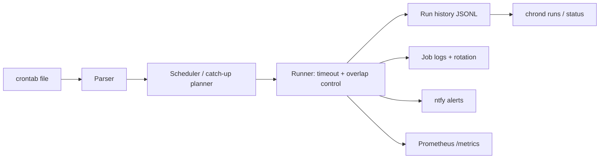

# chrond

[English](README.md) | [中文](README.zh.md) | [日本語](README.ja.md)

[](LICENSE) [](Cargo.toml) [](https://github.com/JaydenCJ/chrond/discussions)

**用 Rust 重写的开源 cron——错过的任务自动补跑、运行历史可查询、日志内置轮转、失败即时告警。**


```bash
git clone https://github.com/JaydenCJ/chrond.git && cargo install --path chrond
```

## 为什么是 chrond？

vixie-cron 会静默失败：机器在 02:15 宕机，02:15 的备份就永远不会执行，而且没有任何提示。它没有运行历史、没有重试、没有告警——想知道"昨晚备份跑了吗"只能去 grep syslog 碰运气。与此同时，sudo、ntp、coreutils 都已被 memory-safe 的 Rust 重写并被发行版采纳，cron 和 logrotate 依然是无人认领的一对。chrond 把定时任务的这两件事一并接管：drop-in 兼容 crontab 语法的调度器，附带逐次运行的结构化记录、错过任务补跑、每个 job 独立输出日志加内置轮转，以及原生 Prometheus/ntfy 告警。

|  | chrond | supercronic | cronie (vixie) |
|---|---|---|---|
| 实现语言 | Rust | Go | C |
| 错过任务补跑 | yes（逐 job `catchup=on`） | no | no（需另装 anacron） |
| 逐次运行历史 | yes（JSONL + `chrond runs`） | 仅日志 | no |
| 重叠控制 | 逐 job（`allow`/`skip`） | 仅全局默认 | no |
| 逐 job 超时 | yes（`timeout=30m`） | no | no |
| 内置日志轮转 | yes（按大小、逐 job） | no | no（外置 logrotate） |
| 推送告警 | 内置 ntfy | no | 仅 MAILTO 邮件 |
| Prometheus 指标 | yes（`/metrics` + `/health`） | yes | no |

## 特性

- **"昨晚备份跑了吗"一条命令给出答案** —— 每个调度时刻都会落一条结构化 JSONL 记录（`ok`、`failed`、`timeout`、`missed`、`skipped_overlap`、`spawn_error`），用 `chrond runs --job backup --since 24h --failed` 直接查询。
- **不再有静默丢失** —— 守护进程宕机期间错过的时刻会在重启后补跑（逐 job `catchup=on`，上限 `max_catchup`）；超出上限的记为 `missed`，而不是凭空消失。
- **Drop-in 兼容 crontab 语法** —— 标准五字段、`@hourly`/`@reboot` 别名、`KEY=value` 环境行、`/etc/crontab` 用户列解析；chrond 的扩展全部放在 `#[chrond]` 注释注解里，文件对经典 cron 仍然有效。
- **失控任务全程可控** —— `overlap=skip` 防止任务堆叠，`timeout=30m` 杀掉整个进程组，两种结果都会被记录并可触发告警。
- **告警不需要胶水脚本** —— 失败时开箱即用的 ntfy 推送（可自托管），外加可供抓取的 Prometheus 文本端点。
- **日志轮转开箱即用** —— 每个 job 的输出追加到独立日志并按大小轮转（`log_max`、`log_keep`），无需任何 logrotate 配置。

## 快速开始

安装（需要 Rust 1.75+）：

```bash
git clone https://github.com/JaydenCJ/chrond.git && cargo install --path chrond
```

编写并校验 crontab：

```bash
cat > mycrontab <<'EOF'
#[chrond] name=nightly-backup catchup=on timeout=30m overlap=skip notify=on_failure
15 2 * * * /usr/local/bin/backup.sh
EOF
chrond check mycrontab
```

输出：

```text
mycrontab: OK (1 job(s), 0 environment assignment(s))

  job: nightly-backup
    schedule: 15 2 * * *
    command:  /usr/local/bin/backup.sh
    catch-up: on (max 1)
    timeout:  1800s
    next[1]:  2026-07-09T02:15:00
    next[2]:  2026-07-10T02:15:00
    next[3]:  2026-07-11T02:15:00
```

前台运行守护进程（对 systemd/容器友好），然后查询历史：

```bash
chrond run --file mycrontab --metrics 127.0.0.1:9090 --ntfy https://ntfy.sh/my-alerts
chrond runs --job nightly-backup --since 24h
chrond status --file mycrontab
```

指标端点只绑定你指定的地址；没有特殊理由请保持 `127.0.0.1`。状态数据（历史、job 状态、日志）默认存放在 `~/.local/state/chrond`（用 `--state` 覆盖）。

## Job 注解

默认行为与 vixie-cron 一致；每个 job 通过其上一行的 `#[chrond]` 注释按需开启扩展。

| 键 | 默认值 | 作用 |
|---|---|---|
| `name` | 从命令推导 | 历史、日志、指标、告警中使用的稳定 job 名 |
| `catchup` | `off` | 补跑守护进程宕机期间错过的时刻 |
| `max_catchup` | `1` | 最多补跑最新的 N 个错过时刻；更早的记为 `missed` |
| `overlap` | `allow` | `skip` 表示不再启动第二个实例，记为 `skipped_overlap` |
| `timeout` | 无 | 超时后杀掉 job 的整个进程组（`30s`、`5m`、`2h`、`1d`） |
| `notify` | `on_failure` | ntfy 策略：`never`、`on_failure`、`always` |
| `log_max` | `1M` | job 输出日志超过该大小即轮转（`512K`、`1M`、`2G`） |
| `log_keep` | `4` | 保留的轮转代数 |

## 架构



## 路线图

- [x] 核心守护进程：crontab 解析、补跑规划器、重叠/超时控制、JSONL 运行历史、内置日志轮转、Prometheus 指标、ntfy 告警
- [ ] systemd unit 与打包，支持 drop-in 系统服务安装
- [ ] crontab 文件变更热加载
- [ ] 以系统 crontab 声明的用户身份运行 job（当前仅解析并告警，以守护进程用户运行）
- [ ] 带退避的重试策略与 MAILTO 邮件兼容

完整列表见 [open issues](https://github.com/JaydenCJ/chrond/issues)。

## 参与贡献

欢迎贡献——参见 [CONTRIBUTING.md](CONTRIBUTING.md)，从 [good first issue](https://github.com/JaydenCJ/chrond/issues?q=is%3Aissue+is%3Aopen+label%3A%22good+first+issue%22) 入手，或到 [Discussions](https://github.com/JaydenCJ/chrond/discussions) 发起讨论。

## 许可证

[MIT](LICENSE)
